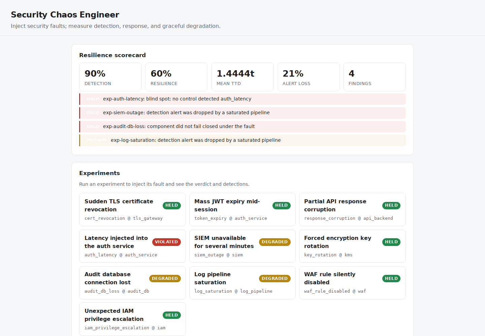
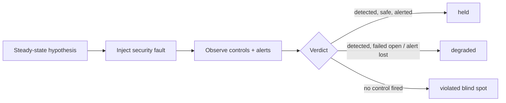

# Security Chaos Engineer

**Chaos Monkey for your security controls. Inject a security fault on purpose,
then measure whether anything detected it, how fast, and whether the system
degraded safely or failed open — and turn the blind spots into findings.**

[](https://github.com/Vincent-P-essy/security-chaos-engineer/actions/workflows/ci.yml)
[](pyproject.toml)
[](LICENSE)

Resilience engineering asks "does the system survive a failed server?" Security
chaos engineering asks the harder question: **"when a security control fails,
does anything notice?"** This tool runs that experiment. It injects security
faults — a revoked certificate, an expired token mid-session, a corrupted API
response, a SIEM outage, a saturated log pipeline, a silently disabled WAF rule,
an IAM privilege escalation — against a modelled system and measures the security
outcome: detection, time-to-detect, alert delivery, and graceful degradation.

The engine is deterministic: identical inputs always yield an identical verdict,
so an experiment is reproducible evidence, and the catalogue doubles as a
regression suite. It runs entirely against a simulated target — it injects
nothing into any real service — and is a portfolio-grade prototype, not a
production chaos platform.

## Dashboard Preview



Local results from the bundled security experiments and deterministic demonstration environment.

## Measured evidence

| Measurement | Reviewed result | Scope |
|---|---:|---|
| Experiments reproducing reviewed outcome | **10/10** | Detection and verdict vs `fixtures/ground-truth.json` |
| Determinism across 200 passes | **1 identical outcome hash** | Hash excludes timing |
| Detection rate | **90%** (9/10) | One fault has only a paper control |
| Resilience (held) rate | **60%** (6/10) | Three faults degrade; one is a blind spot |
| Alert loss rate under saturation | **~21%** | Detections dropped by a bounded pipeline |
| Mean time to detect | **1.44 ticks** | Across detected experiments |
| Test coverage | **96.62%** | Branch-aware source coverage |

The reference stack is deliberately imperfect — the point of chaos is to find
the gaps, so the scorecard reports real ones rather than a clean sweep. See the
[methodology](docs/METHODOLOGY.md) and [reviewed reference run](benchmarks/reference/README.md).

## The experiment lifecycle

Each experiment follows the security chaos loop:

1. **Steady-state hypothesis** — a measurable security property, e.g. "the
   gateway detects a revoked certificate quickly and refuses to serve".
2. **Inject the fault** — a `FaultKind` on a target component.
3. **Observe** — tick the clock while controls fire at their detection latency,
   and account for alert delivery through a bounded pipeline.
4. **Verdict** — `held`, `degraded`, or `violated`.
5. **Roll back** and record.



## The ten experiments

| Experiment | Fault | Reviewed verdict | What it exposes |
|---|---|---|---|
| `exp-cert-revocation` | TLS cert revoked | held | fast detection, fail closed |
| `exp-token-expiry` | JWTs invalidated mid-session | held | re-auth forced |
| `exp-response-corruption` | corrupted API responses | held | integrity check catches it |
| `exp-auth-latency` | latency on auth | **violated** | the SLO alarm is a paper control |
| `exp-siem-outage` | SIEM unavailable | **degraded** | the outage alert is dropped |
| `exp-key-rotation` | forced key rotation | held | KMS monitoring + clean re-key |
| `exp-audit-db-loss` | audit DB connection lost | **degraded** | audit fails *open* (compliance gap) |
| `exp-log-saturation` | log pipeline flooded | **degraded** | real detections lost to noise |
| `exp-waf-disabled` | WAF rule removed | held | config-drift detection |
| `exp-iam-escalation` | privilege escalation | held | access analyzer flags it |

The four non-`held` outcomes become severity-ranked findings in the scorecard.

## Quick start

Requirements: Python 3.11 or 3.12 and [`uv`](https://docs.astral.sh/uv/).

```bash
uv sync --frozen --all-extras

# Run one experiment and inspect the detections
uv run chaos run exp-siem-outage

# Run the whole catalogue and print the resilience scorecard
uv run chaos scorecard

# Measure it (deterministic)
uv run chaos benchmark --iterations 200
```

Start the API and dashboard:

```bash
uv run chaos serve --host 127.0.0.1 --port 8080
```

Open <http://127.0.0.1:8080>. The dashboard shows the scorecard and findings,
lets you run any experiment, and displays which control fired at which tick and
whether its alert was delivered. OpenAPI is at `/docs`.

## Important limitations

- The target system is a **model**; the engine injects nothing into real
  infrastructure and runs no attacker payloads.
- Detection latency is measured in abstract **ticks**, not seconds.
- Whether a control is reliable and whether a component fails closed are
  **declared inputs** — the tool reveals the consequences of a posture you
  describe, it does not discover it from a live system.
- The local API is unauthenticated and must be bound to loopback.

See [architecture](docs/ARCHITECTURE.md), [methodology](docs/METHODOLOGY.md), and
[limitations](docs/LIMITATIONS.md) before interpreting a scorecard.
