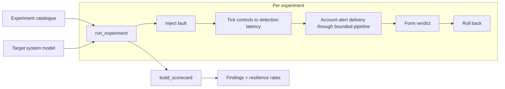

# Architecture

The tool is a deterministic security chaos engine over a simulated target
system. It follows the experiment lifecycle from security chaos engineering:
establish a steady-state hypothesis, inject a fault, observe whether controls
detect and absorb it, measure, and roll back.

## The target system model

- **Components** own a `fails_closed` flag: whether the component degrades safely
  when its fault hits.
- **Security controls** declare which fault kinds they `cover`, a
  `detection_latency_ticks`, and a `reliable` flag. An unreliable control is a
  *paper control*: it exists on the architecture diagram but never fires.
- **The alert pipeline** has a bounded `capacity`. A fault emits competing alert
  volume that occupies the pipeline first, so a flood can drown the very
  detection that matters (alert loss).

## The verdict

For each experiment the engine computes:

- `detected` — did any reliable covering control fire within the horizon;
- `time_to_detect_ticks` — the earliest such control's latency;
- graceful — the affected component's `fails_closed`;
- alert delivery — whether the detecting control's alert survived the pipeline.

These collapse to a steady-state verdict:

| Verdict | Meaning |
|---|---|
| `held` | detected, alert delivered, component failed closed |
| `degraded` | detected, but failed open or the alert was dropped |
| `violated` | not detected within the horizon (a blind spot) |

## Why deterministic

Real chaos experiments are noisy; this model is deliberately not. Every input
maps to exactly one verdict, so the catalogue doubles as a regression suite: a
change that weakens a control shows up as a changed verdict, and the benchmark's
single outcome hash flips. That is what makes a security chaos result reviewable
rather than anecdotal.
